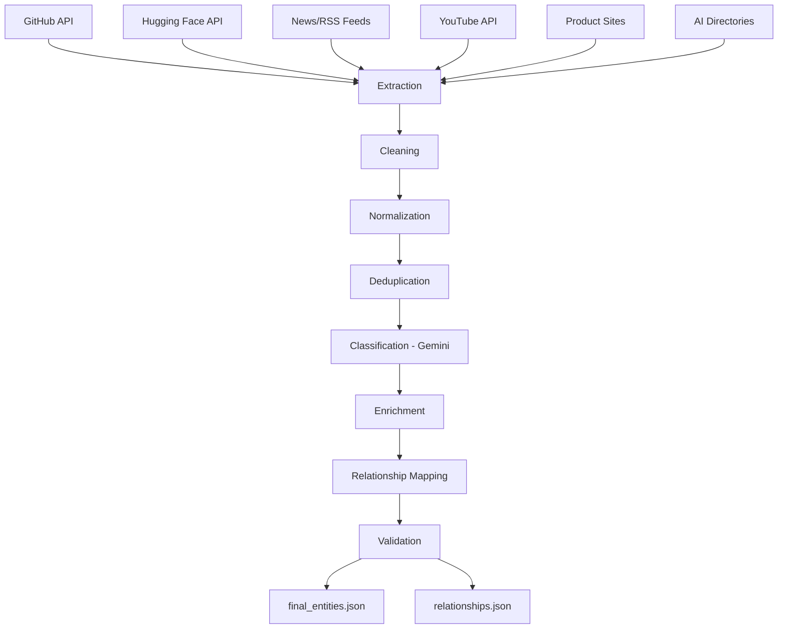

# AI Orbit Data Ingestion Pipeline

A pipeline that pulls data from multiple AI ecosystem sources, cleans it,
dedupes it, classifies it, and outputs a structured dataset with entity
relationships for the AI Orbit platform.

## Architecture

## Folder structure

    ai-orbit-pipeline/
        src/
            schema.py
            fetch_github.py
            fetch_huggingface.py
            fetch_news.py
            fetch_youtube.py
            fetch_productsites.py
            fetch_directories.py
            clean.py
            normalize.py
            dedup.py
            classify.py
            enrich.py
            relationships.py
            validate.py
        data/
            (all json outputs land here)
        run.py
        README.md

## Sources used

- GitHub Search API — repos, MCP servers
- Hugging Face Models API — AI models
- News/RSS — TechCrunch, The Verge, VentureBeat
- YouTube Data API v3 — AI tutorials/demos/reviews
- Official product sites — scraped meta title/description
- AI directories — scraped listing pages

## Pipeline stages

Discovery -> Extraction -> Cleaning -> Normalization -> Deduplication ->
Classification -> Enrichment -> Relationship Mapping -> Validation

Each stage is its own script in `src/`, and each writes its output to
`data/` so you can check the data after every step.

## Setup

1. Clone the repo

        git clone <your-repo-url>
        cd ai-orbit-pipeline

2. Install dependencies

        pip install httpx beautifulsoup4 feedparser rapidfuzz

3. Get your own API keys:
   - GitHub token: https://github.com/settings/tokens
   - YouTube API key: Google Cloud Console -> enable YouTube Data API v3
   - Gemini API key: https://aistudio.google.com/apikey

4. Set them as environment variables (PowerShell)

        $env:GITHUB_TOKEN="your_github_token_here"
        $env:YOUTUBE_API_KEY="your_youtube_api_key_here"
        $env:GEMINI_API_KEY="your_gemini_api_key_here"

## How to run

    python run.py

Or run each script individually from `src/` in the stage order above.

## Output files

- `data/final_entities.json` — final validated dataset (317 records)
- `data/relationships.json` — relationships between entities (194 links)

## Notes / limitations

- Company founding year and headquarters are marked "unknown" where there
  wasn't a reliable source — didn't want to fill in guessed data.
- A few product sites (OpenAI, Perplexity, Midjourney) block simple scraping
  requests (403), so those were skipped.
- Relationships are inferred through name/source matching, not manually
  verified one by one.
- Classification uses Gemini to double-check entity_type and categories
  since some sources don't cleanly map to one category on their own.

## Tech stack

Python, httpx, BeautifulSoup, feedparser, rapidfuzz, Gemini API